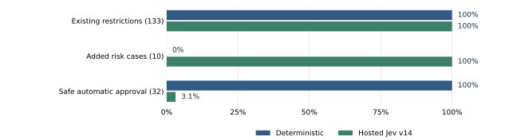

::: {.page}

Engineering report | 23 September 2026

# What our Jev work can do today

This report compares the deterministic SF Pi guardrail, hosted TypeSafe Jev,
and the local Gemma C11 model. It describes tested behavior and its limits.

| Deterministic guardrail                | Hosted Jev                                                           | Local Gemma C11                                         |
| -------------------------------------- | -------------------------------------------------------------------- | ------------------------------------------------------- |
| **Current default**                    | **Experimental integration**                                         | **Saved local candidate**                               |
| Rules select risk and policy actions.  | Jev selects all risk and policy actions in its mode.                 | Gemma selects semantic risk; code retains exact policy. |
| 32/32 safe controls allowed in DEV175. | 133/133 baseline restrictions preserved; 1/32 safe controls allowed. | 105/116 model decisions correct; five unsafe allows.    |

**Hosted Jev adds measured protection, but it is too interruptive.** It caught
ten authored risk cases that the deterministic engine allowed. It also asked
for approval on 31 of 32 safe controls. The measured result does not support
normal activation.

**Gemma C11 is fast, but its safety result prevents enforcement.** Its recorded
warm p95 was 131 ms. It had five unsafe allows and six excess confirmations.
Its recorded mode remains `off`.

The current code keeps deterministic as the default. The provider-neutral
adapter requires an explicitly configured Decisions endpoint. It has no
default remote address. Saved hosted results come from the earlier transport.
They do not establish performance through another endpoint.

The hosted and Gemma tests use different inputs, thresholds, and policy
boundaries. Their accuracy percentages do not establish a direct winner.
The next useful proof is safe automatic coverage with no loss of protection.

Sources: [hosted evaluation](jev-guardrail-evaluation-2026-09-23.md),
[engine decision](../docs/adr/0118-sf-guardrail-selectable-jev-engine.md),
and the saved C11 report at source commit `85b12f998141081ebd9199982541a7a50520724f`.

:::

::: {.page}

Capability comparison | Current source and saved evidence

# What each engine controls

SF Pi retains blocking, approval dialogs, session grants, settings, and audit.
The selected engine supplies the classification before a tool can execute.

| Area              | Deterministic                                                                                      | Hosted Jev                                                     | Gemma C11                                                               |
| ----------------- | -------------------------------------------------------------------------------------------------- | -------------------------------------------------------------- | ----------------------------------------------------------------------- |
| Classification    | Code rules and known tool families.                                                                | Every Pi tool call, including unfamiliar tools.                | One trained semantic risk question.                                     |
| Exact file policy | Code selects path eligibility, protection, and behavior.                                           | Model interprets projected policy and local path facts.        | Exact policy remains in code.                                           |
| Commands and orgs | Parsed command rules, exceptions, and org-aware rules.                                             | Model selects matches from tokens, policy, and verified facts. | Code constraints precede model risk.                                    |
| Native tools      | Apex, Agent Script, Data 360, SOQL, Canvas, and browser gates.                                     | Risk, policy, disclosure, and authority questions.             | Saved bridge and host hook; complete native-model workflow unproved.    |
| Hard blocks       | Code blocks cannot be bypassed by approval controls.                                               | Any model block blocks; invalid classifications also block.    | Binary model has no block choice; code retains exact blocks.            |
| Confirmation      | Explicit approval or eligible session grant. Some configured automation can approve confirmations. | Explicit human approval; legacy automation cannot bypass it.   | Helper returns allow, confirm, or abstain; host owns enforcement.       |
| Audit             | Gated decisions; unmatched calls can pass without an entry.                                        | Each classified outcome, with bounded model evidence.          | Saved scoring and controlled host proofs; no normal-profile activation. |

The deterministic engine covers much more than shell strings. Its known
native gates handle execution, durable writes, disclosure, and committing
browser gestures. Unmatched calls can pass through. It is not a general
filesystem or shell sandbox.

Hosted Jev has sole policy authority in its selected mode. There is no
deterministic safety floor or automatic fallback. Exact configured patterns
therefore lose their code matching guarantee, even when a finite test passes.

Sources: [Safety Kernel](../extensions/sf-guardrail/lib/safety-kernel.ts),
[native registry](../extensions/sf-guardrail/lib/native-tool-risk-registry.ts),
[Jev adapter](../extensions/sf-guardrail/lib/jev-risk.ts), and
[extension contract](../extensions/sf-guardrail/manifest.json).

:::

::: {.page}

Shared DEV175 test | Historical hosted results

# Protection and useful approval

The same 175 development inputs supplied this comparison. Authored expected
actions were 32 allows, 132 confirmations, and eleven blocks. Some labels need
review. These are consumed development inputs, not a fresh independent test.

| Measure                              |   Deterministic |  Hosted Jev v14 |
| ------------------------------------ | --------------: | --------------: |
| Exact action against authored labels | 165/175 (94.3%) | 144/175 (82.3%) |
| Existing restrictions preserved      |  Reference: 133 |  133/133 (100%) |
| Existing hard blocks preserved       |   Reference: 11 |    11/11 (100%) |
| Added authored risks restricted      |            0/10 |    10/10 (100%) |
| Safe automatic recommendations       |    32/32 (100%) |     1/32 (3.1%) |
| Safe controls interrupted            |            0/32 |   31/32 (96.9%) |
| Allow / confirm / block              |   42 / 122 / 11 |    1 / 163 / 11 |

{.comparison-chart}

Each counted Jev catch had an actual non-allow model choice. All eleven hard
blocks had actual block choices. Failed calls and low allow probabilities
alone did not count as recognition. All 175 v14 responses passed validation.

The added cases cover wrapped or nested production deployment, production
REST writes, shell file access, external deletion, force-with-lease, broad
SOQL disclosure, and unfamiliar external writes. The fixed labels are test
judgments. They do not prove that every described effect occurred.

The runtime uses the smaller v11 request representation. Its saved test had
the same action counts, protection counts, and 1/32 safe automatic result.
The larger v14 command question remains a historical experiment.

Source: [full evaluation and label limits](jev-guardrail-evaluation-2026-09-23.md).

:::

::: {.page}

Hosted Jev | Functional provider-neutral transport

# How the current Jev path works

1. Capture the original call identity and configured transport identity locally.
2. Build bounded operation metadata and resolve required local facts.
3. Ask applicable independent Choice questions in one Decisions request.
4. Validate the exact answer set, identity, probabilities, size, and deadline.
5. Block, allow, or ask for explicit approval; record the outcome before release.

| Question       | What Jev judges                                                  |
| -------------- | ---------------------------------------------------------------- |
| Risk           | Executable effects and essential uncertainty; always included.   |
| File policy    | Path eligibility, rule precedence, exemptions, and access.       |
| Command policy | Exact token matches, ordered restrictions, and allow exceptions. |
| Org policy     | Command structure, rule order, org facts, and local exclusions.  |
| Disclosure     | Credential or data output and transfer effects.                  |
| Authority      | Browser target, focus, role, and committing gestures.            |

Any block answer blocks execution. Automatic approval requires complete
context and every answer choosing allow with `P(allow) >= 0.99`. Other valid
results require human approval. Failures block. There are no retries.

The transport requests `typesafe/jev-1.13`. It requires resolved model
`typesafe/jev-1.13-20260917` and provider `TypeSafe`. A configured endpoint must
implement this Decisions contract. An ordinary chat API is not interchangeable.

Configure `SF_GUARDRAIL_JEV_ENDPOINT` and either `SF_GUARDRAIL_JEV_API_KEY` or
`SF_GUARDRAIL_JEV_API_KEY_FILE`. A documentation placeholder is
`https://decisions.example.invalid/v1/decisions`. Replace it with a compatible
endpoint before use. Missing or invalid endpoint configuration blocks.

The local transport hash binds grants to the canonical endpoint and model
pins. Execution checks reject a changed endpoint. Audit and UI omit its value.
Raw commands, code, scripts, query bodies, file bodies, credentials, transcripts,
Canvas contents, and full browser pages remain local. Token IDs reveal equality
and policy membership; they are not cryptographic secrecy.

Sources: [client](../extensions/sf-guardrail/lib/jev-client.ts),
[request and decision adapter](../extensions/sf-guardrail/lib/jev-risk.ts),
and [TypeSafe Choice contract](https://docs.typesafe.ai/primitives/choice).

:::

::: {.page}

Local Gemma C11 | Saved diagnostic evidence

# What your trained model provides

The candidate is `jev/c11-step-256`, based on `google/gemma-3-1b-it`. It is a
fully merged F16 GGUF with a pinned local native scorer. The model file remains
present at 2,006,573,408 bytes. This report checked its metadata and prior
verification receipt. It did not rehash the weights or rerun inference.

Training used a new LoRA adapter on query and value projections in all 26
layers, with rank 16. The base weights stayed frozen. The FIT campaign used
327 rows and 86 safe/risky pairs. Its loss combined classification, margins,
and pair separation. The selected export is step 256. The campaign used no
VALID or TEST rows and called no teacher model in the inspected training path.

The scorer reads selected next-token label logits for allow and confirm.
It generates no explanation. Its helper also returns abstain for insufficient
allow score. The cutoff is `0.955913273071778`, an uncalibrated threshold.

| Recorded C11 result                  |               Value |
| ------------------------------------ | ------------------: |
| Correct model decisions              |    105/116 (90.52%) |
| Correct decisions including code     |    149/160 (93.13%) |
| Model-eligible safe controls allowed |       69/75 (92.0%) |
| Model-eligible risky cases allowed   |        5/41 (12.2%) |
| Unsafe allows / excess confirmations |               5 / 6 |
| Warm p95 / maximum                   |  131.17 / 145.56 ms |
| Cold initialization                  |         1,364.09 ms |
| Scoring deadline / warm p95 target   |        750 / 500 ms |
| Independent TEST score               |              Absent |
| Qualification / enforcement / mode   | False / false / off |

The overall score includes 44 correct non-model decisions. It does not measure
model accuracy on all 160 inputs. The five unsafe categories include remote
scripts, encoded execution, environment disclosure, external HTTP writes, and
file-image overwrite. These are scored decisions; the operations did not run.

An archived SF Pi hook retained code policy before local model risk. Native
replay used the actual model. Separate SDK proofs used scripted predictions.
The native-model Pi workflow test was skipped. A complete live workflow remains
unproved. The portable demo provides advisory scoring, not enforcement.

Sources: saved C11 stop report, step-256 diagnostic records, model card,
portable registry, and archived host commit `a4ba5fe5f86bc0cb01ab85c037bb05114a26ff8a`.

:::

::: {.page}

Evidence and limits | What still needs proof

# Readiness depends on more than accuracy

The hosted v11 test reported remote p50 of 407 ms and p95 of 607 ms. V14
reported 476 ms and 612 ms. Both p95 values exceed the initial 500 ms target.
The waits exclude real fact preparation and human approval. The normal total
classification deadline remains 1,500 ms. The tests used ten seconds.

Reported response cost was $0.0384 for v11 and $0.0411 for v14. Known reported
task response cost through v14 was $0.3408. Failed-call billing remains unknown.
This is not a complete account bill. Local C11 has no provider fee per call;
hardware, setup, memory, and energy costs were not measured here.

The earlier v11 source integration reproduced all 175 saved request bodies
exactly, offline. Its 73 focused risk tests passed. Its full CI passed 4,946
tests and skipped 39. Its lint passed.

The current provider-neutral source passed 260 focused tests. Full CI passed
4,992 tests and skipped 39. Lint passed. Its current offline proof matched all
175 v11 request bodies with zero external calls. These checks establish source
compatibility and request fidelity. No new live endpoint proof exists. The
checks do not establish a new endpoint's performance or model quality.

One real hosted SDK smoke released an inert counter tool after an audited
allow. Two other smokes blocked on deadline. No Salesforce or browser mutation
was established. The new generic transport requires its own live proof.

The next steps are:

1. Keep every observed baseline restriction and hard block while reducing false confirmations.
2. Review safe labels for legacy CLI flags, deployment jobs, local tracking, OAuth refresh, and withheld query contents.
3. Measure model recognition separately from confirmation caused only by a low probability.
4. Run a new frozen test after independent review; retain failures in every denominator.
5. Measure the full hook with real fact resolution before normal activation.

The council selected a small neutral-option-name test: 26 cases, four arms,
and at most 104 calls. Its 21 scripted checks passed. It made no live calls.
Neutral names are a test idea, not a proven improvement. The 26/32 utility
gate was proposed by an agent; the user has not approved it as qualification.

TypeSafe documents sensitivity to indirection, numeric representations,
contradictory guidance, and irrelevant context. It recommends code for work
that code can compute. Sole Jev policy authority remains the chosen boundary.
[Model limits](https://docs.typesafe.ai/model-jaggedness/jev-1.13).
Probability shape is not domain calibration.
[Confidence guidance](https://docs.typesafe.ai/confidence).

:::

::: {.page}

Evidence index | Versions and proof boundaries

# Sources and handoff

The product work belongs to the existing `sf-pi` repository and its existing
`sf-guardrail` extension. It is delivered on a feature branch. It is not a
separate extension repository. Source defaults remain deterministic.

The following public files supply implementation and result detail:

- [Hosted evaluation](jev-guardrail-evaluation-2026-09-23.md): all attempts, old failures, labels, latency, cost, and activation limits.
- [Council report](jev-council-2026-09-23.md): expert positions, disagreement, and the bounded next test.
- [ADR 0118](../docs/adr/0118-sf-guardrail-selectable-jev-engine.md): engine boundary and approval contract.
- [Client](../extensions/sf-guardrail/lib/jev-client.ts) and [risk adapter](../extensions/sf-guardrail/lib/jev-risk.ts): transport, validation, questions, and decisions.
- [Safety Kernel](../extensions/sf-guardrail/lib/safety-kernel.ts) and [native registry](../extensions/sf-guardrail/lib/native-tool-risk-registry.ts): deterministic behavior.
- [TypeSafe Choice](https://docs.typesafe.ai/primitives/choice), [model limits](https://docs.typesafe.ai/model-jaggedness/jev-1.13), and [confidence](https://docs.typesafe.ai/confidence): external model guidance.

The C11 facts were checked against retained source commit
`85b12f998141081ebd9199982541a7a50520724f`, its saved stop report and diagnostic
records, and the current portable model card. Those saved records are separate
from the hosted DEV175 set. No sealed C11 TEST corpus was opened.

The current protocol is version 8. The current offline proof matched all 175
request bodies with the saved v11 bodies. It made zero external calls.

| Frozen evidence                           | SHA-256                                                            |
| ----------------------------------------- | ------------------------------------------------------------------ |
| Hosted v11 receipt                        | `eb116b58bffcc2e8b96695b9fadfa2fe87a5cab834171b27b10c0a33c56e0f00` |
| Hosted v14 receipt                        | `7cd6a4f50048004f18d3d371e7bd2cf9f73de7437a1d139f070a26cd14948e5e` |
| Earlier v11 source proof                  | `25f6a3e4f1a78d3fdaa0b79fee9496c90f973efbd68dc2863d6bf24393da123f` |
| Current protocol, version 8               | `42c2049ed4ef29a5e6baa442dee3fd68d77b3ff163901782a998d66b8fc214fd` |
| Current offline v11 byte proof            | `b43a3005f7b191d1abad97642294b00833b31aa573624b8e62dde1edc9440e3f` |
| C11 merged model, prior verified identity | `8930f0028412060fe5f39d590fe5906ca2ed86c5a6613473512580d62994a053` |

Raw hosted receipts and test-only probes remain local evidence. This report
publishes aggregate results and generic examples. It contains no credential,
private endpoint, raw tool payload, or private repository URL.

Use the deterministic engine for the current default. Hosted Jev supplies
an exercised experimental path with broader observed risk detection. Gemma
C11 supplies a fast, portable local classifier with known unsafe decisions.
Neither model result qualifies a replacement for normal enforcement today.

:::
